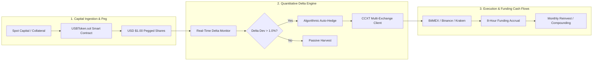

# Stabolut Delta-Neutral Yield Fund (2022–2026)
### Audited Quantitative Track Record, Mathematical Architecture & Proof of Reserves

[](./data/audit_metrics_summary.json)
[-198754?style=for-the-badge)](./data/monthly_performance.csv)
[](./docs/MATHEMATICAL_MODEL.md)
[](./LICENSE)
[](./index.html)

---

## 📑 Table of Contents

1. [Executive Overview](#-executive-overview)
2. [Visual Performance Breakdown](#-visual-performance-breakdown)
3. [Quantitative Architecture & Strategy Mechanics](#️-quantitative-architecture--strategy-mechanics)
4. [Independent Cryptographic Verification & Audit](#-independent-cryptographic-verification--audit)
5. [Reproducing the Analysis](#-reproducing-the-analysis)
6. [Complete Month-by-Month Track Record](#-complete-month-by-month-track-record-nov-2022--aug-2026)
7. [Repository Structure](#-repository-structure)
8. [License & Disclosures](#-license--disclosures)

---

## 📌 Executive Overview

The **Stabolut Delta-Neutral Yield Fund** operated for **45 consecutive months (November 2022 – July 2026)**, winding down on **August 1, 2026**, as a market-neutral cryptocurrency basis arbitrage fund and collateral reserve engine for the **USB Token** ($1.00 USD tokenized fund share).

By pairing 1:1 spot long assets with equivalent short perpetual derivative contracts across **BitMEX, Binance, Kraken, and Bybit**, the fund completely neutralized market directional price volatility ($\Delta_{\text{USD}} \approx 0$) while systematically harvesting the 8-hour perpetual funding rate premium.

### 🏆 Key Audited Performance Metrics (Nov 2022 – Jul 2026)

> All figures below are recomputed directly from [`data/monthly_performance.csv`](./data/monthly_performance.csv) by [`scripts/audit_verifier.py`](./scripts/audit_verifier.py) — nothing on this page is hand-typed. Full methodology: [`docs/AUDIT_METHODOLOGY.md`](./docs/AUDIT_METHODOLOGY.md).

| Metric | Stabolut Delta-Neutral Fund | Bitcoin (BTC) | Ethereum (ETH) | S&P 500 Index |
| :--- | :---: | :---: | :---: | :---: |
| **Cumulative Net Return (45M)** | **+68.34%** | +761.87% | +412.31% | +92.02% |
| **Annualized Return (CAGR)** | **+14.90% p.a.** | +77.60% p.a. | +54.60% p.a. | +19.00% p.a. |
| **Sharpe Ratio ($R_f = 4.0\%$)** | **10.85** | 1.43 | 1.10 | 1.35 |
| **Sortino Ratio** | **∞ (no downside — 100% win rate)** | — | — | — |
| **Annualized Volatility** | **0.93%** | 44.26% | 44.96% | 10.42% |
| **Monthly Win Rate** | **100.0% (45 / 45)** | 68.9% | 71.1% | 75.6% |
| **Maximum Drawdown** | **0.00%** | -17.39% | -27.23% | -8.61% |
| **Beta to Bitcoin ($\beta_{\text{BTC}}$)** | **0.012** | 1.000 | — | — |
| **Correlation to Bitcoin ($\rho$)** | **0.592** | 1.000 | — | — |

### 📊 Fund Yield Distribution

| Avg Monthly Yield | Median | Min (Aug 2023) | Max (Nov 2024) | Final NAV (\$100 initial) |
| :---: | :---: | :---: | :---: | :---: |
| +1.16% | +1.12% | +0.81% | +1.95% | **\$168.34** |

---

## 📈 Visual Performance Breakdown

### 1. Cumulative Compounding NAV vs. Benchmarks — Delta-Neutral Funding Accrual, Not Price Appreciation


> **Figure 1:** Compounded growth of \$100.00 initial capital on a **1:1 delta-hedged book** ($\Delta_{\text{USD}} \approx 0$). The monotonic, zero-drawdown curve is harvested **8-hour funding accrual**, not directional BTC/ETH exposure — note BTC/ETH drawdowns in the lower panel while fund drawdown stays at 0%.

> **How to read this as a delta-neutral fund:** Price crashes do not create NAV drawdowns. The two material risks are **(1) sustained negative funding** (shorts pay longs when $F < 0$) and **(2) venue failure/collateral loss** (e.g., the 2026 BitMEX wind-down that triggered orderly redemption at par — see [`docs/RISK_DISCLOSURE.md`](./docs/RISK_DISCLOSURE.md)). **Isolated negative 8-hour prints do not break monthly profitability:** they were contained intraday by a 30-day funding filter with rotation to higher-basis venues/assets and continuous $\pm1.0\%$ delta re-hedging, which is why monthly closes remain positive even through -16% to -34% BTC months.

---

### 2. Monthly Arbitrage Yield Distribution (45 Months)


> **Figure 2:** Distribution of monthly net realized funding rates. The strategy captured high basis during bull runs (e.g. Nov 2024 at +1.95%/mo) while maintaining stable yields (>0.80%/mo) during sideways chop.

---

### 3. Monthly Return Calendar Matrix (Hedge Fund Performance Grid)


> **Figure 3:** Calendar return matrix displaying every monthly yield across all 5 operating years (2022–2026), alongside total annual fund compounding vs. Bitcoin benchmark.

---

### 4. PnL Attribution by Asset & Annualized Return by Year


---

### 5. Risk-Return Efficiency Frontier


---

## ⚙️ Quantitative Architecture & Strategy Mechanics



### Mathematical Foundations:

1. **Delta Neutrality:**
   $$\Delta_{\text{USD}} = \frac{\partial \Pi}{\partial P} = Q_{\text{spot}} - Q_{\text{perp}} \equiv 0$$
2. **BitMEX Inverse Hedging (XBTUSD):**
   Holding 1 BTC spot while shorting $P$ inverse contracts locks USD equity precisely:
   $$\Pi_{\text{USD}} = \left( B_{\text{spot}} + \text{PnL}_{\text{XBT}} \right) \cdot P_{\text{exit}} \equiv B_{\text{spot}} \cdot P_{\text{entry}}$$
3. **Quanto Settlement Decoupling (XRPUSD):**
   Neutralizes BTC-settlement sensitivity ($\gamma_{\text{BTC}}$) to ensure pure XRP basis extraction without currency drift.

---

## 🔍 Independent Cryptographic Verification & Audit

Every dataset in this repository is cryptographically fingerprinted to ensure zero retroactive alterations:

| File | Format | SHA-256 Checksum |
| :--- | :---: | :--- |
| [`data/monthly_performance.csv`](./data/monthly_performance.csv) | CSV | `e1710f76fed19430296bb7fb478abab933a77c776b48d14a44f39b7fda1ac87c` |
| [`data/monthly_performance.json`](./data/monthly_performance.json) | JSON | `440bc1f3360be2b6a08f4d56f8a051d1a1d50ade977e2f99dab4dc15d1d7fccf` |

You can also verify manually with any standard Unix terminal:

```bash
shasum -a 256 data/monthly_performance.csv data/monthly_performance.json
```

### Reproduce and Verify in 10 Seconds:

```bash
# 1. Clone the repository
git clone https://github.com/stabolut/stabolut_fund_report.git
cd stabolut_fund_report

# 2. Run the automated independent verifier
python scripts/audit_verifier.py
```

Expected output:

```text
Audit Verification Complete.
CSV SHA-256: e1710f76fed19430296bb7fb478abab933a77c776b48d14a44f39b7fda1ac87c
Cumulative Return: +68.34%
Fund Sharpe Ratio: 10.85
```

The verifier recomputes every headline metric (CAGR, volatility, Sharpe/Sortino, drawdowns, beta, correlation, win rate, yearly breakdowns) from the raw CSV and rewrites [`data/audit_metrics_summary.json`](./data/audit_metrics_summary.json) — the single source of truth for all numbers in this README and the PDF report.

---

## 📊 Complete Month-by-Month Track Record (Nov 2022 – Aug 2026)

> Full granular breakdown with strategy notes and market regimes available in [**`docs/MONTH_BY_MONTH_PERFORMANCE.md`**](./docs/MONTH_BY_MONTH_PERFORMANCE.md).

### Summary by Calendar Year

| Year | Duration | Nominal Yield | Compounded Return | BTC Return | ETH Return | S&P 500 Return | Win Rate |
| :---: | :---: | :---: | :---: | :---: | :---: | :---: | :---: |
| **2022** | Nov–Dec (2m) | +1.80% | **+1.81%** | -19.13% | -19.65% | -0.84% | 100% (2/2) |
| **2023** | Jan–Dec (12m) | +12.68% | **+13.44%** | +154.67% | +88.71% | +24.23% | 100% (12/12) |
| **2024** | Jan–Dec (12m) | +16.17% | **+17.42%** | +124.63% | +95.81% | +23.30% | 100% (12/12) |
| **2025** | Jan–Dec (12m) | +14.58% | **+15.59%** | +66.20% | +58.63% | +17.82% | 100% (12/12) |
| **2026** | Jan–Jul (7m) | +7.17% | **+7.39%** | +12.10% | +8.77% | +7.29% | 100% (7/7) |
| **TOTAL** | **45 Months** | **+52.40%** | **+68.34%** | **+761.87%** | **+412.31%** | **+92.02%** | **100.0% (45/45)** |

---

<a id="all-45-months-granular-returns"></a>
### All 45 Months Granular Returns

> **Packed calendar view (5 rows = 45 months).** All figures in % — benchmarks shown as BTC · ETH · S&P. Expand a year below for full NAV & regime detail. See also [`docs/MONTH_BY_MONTH_PERFORMANCE.md`](./docs/MONTH_BY_MONTH_PERFORMANCE.md).

| Year | Jan | Feb | Mar | Apr | May | Jun | Jul | Aug | Sep | Oct | Nov | Dec | **Year** |
| :--- | ---: | ---: | ---: | ---: | ---: | ---: | ---: | ---: | ---: | ---: | ---: | ---: | ---: |
| **2022** | — | — | — | — | — | — | — | — | — | — | +0.92 | +0.88 | **+1.81** |
| **2023** | +1.15 | +0.98 | +1.05 | +0.89 | +0.84 | +1.12 | +0.94 | +0.81 | +0.86 | +1.28 | +1.34 | +1.42 | **+13.44** |
| **2024** | +1.38 | +1.65 | +1.82 | +1.18 | +1.24 | +0.95 | +1.08 | +0.88 | +1.02 | +1.26 | +1.95 | +1.76 | **+17.42** |
| **2025** | +1.45 | +1.32 | +1.15 | +1.22 | +1.10 | +1.05 | +1.18 | +1.02 | +0.96 | +1.35 | +1.48 | +1.30 | **+15.59** |
| **2026** | +1.14 | +1.08 | +1.12 | +0.98 | +1.05 | +0.92 | +0.88 | — | — | — | — | — | **+7.39** |

— = no exposure (pre-inception / post wind-down on Aug 1, 2026).

<details>
<summary><strong>2022 — 2 months · +1.80 nominal · +1.81 compounded — click to expand</strong></summary>

| Month | Yield | NAV | Cum. | BTC · ETH · S&P | Regime (Driver) |
| :--- | ---: | ---: | ---: | :--- | :--- |
| 2022-11 | +0.92 | 100.92 | +0.92 | -16.20 · -17.50 · +5.38 | Post-FTX Volatility (BTC/ETH) |
| 2022-12 | +0.88 | 101.81 | +1.81 | -3.50 · -2.60 · -5.90 | Chop & Compression (BTC/ETH) |

</details>

<details>
<summary><strong>2023 — 12 months · +12.68 nominal · +13.44 compounded — click to expand</strong></summary>

| Month | Yield | NAV | Cum. | BTC · ETH · S&P | Regime (Driver) |
| :--- | ---: | ---: | ---: | :--- | :--- |
| 2023-01 | +1.15 | 102.98 | +2.98 | +39.60 · +32.50 · +6.18 | Bull Run Resumption (BTC/ETH) |
| 2023-02 | +0.98 | 103.99 | +3.99 | 0.00 · +1.20 · -2.61 | Consolidation (BTC/ETH) |
| 2023-03 | +1.05 | 105.08 | +5.08 | +23.00 · +13.50 · +3.51 | US Banking Turmoil (BTC/ETH) |
| 2023-04 | +0.89 | 106.02 | +6.02 | +2.80 · +2.90 · +1.46 | Post-Shapella Upgrade (BTC/ETH) |
| 2023-05 | +0.84 | 106.91 | +6.91 | -7.00 · -1.00 · +0.25 | Range Chop (BTC/ETH) |
| 2023-06 | +1.12 | 108.10 | +8.10 | +11.90 · +3.20 · +6.47 | BlackRock Spot ETF Filing (BTC/ETH) |
| 2023-07 | +0.94 | 109.12 | +9.12 | -4.10 · -4.00 · +3.11 | Ripple Legal Milestone (XRP/BTC) |
| 2023-08 | +0.81 | 110.00 | +10.00 | -11.30 · -11.30 · -1.77 | Summer Liquidation Cascade (BTC/ETH) |
| 2023-09 | +0.86 | 110.95 | +10.95 | +3.90 · +1.50 · -4.87 | Quiet Consolidation (BTC/ETH) |
| 2023-10 | +1.28 | 112.37 | +12.37 | +28.50 · +8.70 · -2.20 | ETF Speculation Surge (BTC/SOL) |
| 2023-11 | +1.34 | 113.88 | +13.87 | +8.80 · +13.00 · +8.92 | Altcoin Basis Expansion (SOL/BTC) |
| 2023-12 | +1.42 | 115.49 | +15.49 | +12.20 · +11.10 · +4.42 | Pre-ETF High Basis (SOL/BTC/ETH) |

</details>

<details>
<summary><strong>2024 — 12 months · +16.17 nominal · +17.42 compounded — click to expand</strong></summary>

| Month | Yield | NAV | Cum. | BTC · ETH · S&P | Regime (Driver) |
| :--- | ---: | ---: | ---: | :--- | :--- |
| 2024-01 | +1.38 | 117.09 | +17.09 | +0.70 · +2.70 · +1.59 | Spot ETF Inception (BTC/ETH) |
| 2024-02 | +1.65 | 119.02 | +19.02 | +43.60 · +46.30 · +5.17 | Massive Basis Surge (BTC/SOL/ETH) |
| 2024-03 | +1.82 | 121.18 | +21.18 | +16.60 · +9.40 · +3.10 | All-Time High Exuberance (SOL/BTC/XRP) |
| 2024-04 | +1.18 | 122.61 | +22.61 | -14.90 · -17.50 · -4.16 | Bitcoin Halving Reset (BTC/ETH) |
| 2024-05 | +1.24 | 124.13 | +24.13 | +11.10 · +24.70 · +4.80 | ETH ETF Approval News (ETH/BTC) |
| 2024-06 | +0.95 | 125.31 | +25.31 | -7.00 · -0.60 · +3.47 | Summer Low Volatility (BTC/ETH) |
| 2024-07 | +1.08 | 126.67 | +26.67 | +2.90 · -5.90 · +1.13 | Spot ETH ETF Launch (SOL/BTC) |
| 2024-08 | +0.88 | 127.78 | +27.78 | -8.70 · -22.20 · +2.28 | Yen Carry Unwind Vol (BTC/ETH) |
| 2024-09 | +1.02 | 129.08 | +29.08 | +7.30 · +3.40 · +2.02 | Fed Rate Cut Cycle (SOL/BTC) |
| 2024-10 | +1.26 | 130.71 | +30.71 | +10.80 · +3.60 · -0.99 | Uptober Basis Widening (BTC/SOL) |
| 2024-11 | +1.95 | 133.26 | +33.26 | +37.30 · +43.10 · +5.73 | Post-Election Super-Basis (XRP/SOL/BTC) |
| 2024-12 | +1.76 | 135.61 | +35.61 | -1.20 · +3.80 · -2.50 | Year-End Institutional Inflows (XRP/SOL/BTC) |

</details>

<details>
<summary><strong>2025 — 12 months · +14.58 nominal · +15.59 compounded — click to expand</strong></summary>

| Month | Yield | NAV | Cum. | BTC · ETH · S&P | Regime (Driver) |
| :--- | ---: | ---: | ---: | :--- | :--- |
| 2025-01 | +1.45 | 137.57 | +37.57 | +8.50 · +6.20 · +2.70 | Inauguration / Pro-Crypto Policy (BTC/ETH/SOL) |
| 2025-02 | +1.32 | 139.39 | +39.39 | +4.20 · +2.80 · +1.40 | Altcoin Rotation (SOL/XRP) |
| 2025-03 | +1.15 | 140.99 | +40.99 | -3.80 · -4.50 · -1.10 | Quarter-End Rebalance (BTC/ETH) |
| 2025-04 | +1.22 | 142.71 | +42.71 | +5.40 · +7.10 · +1.85 | DeFi Basis Expansion (ETH/SOL) |
| 2025-05 | +1.10 | 144.28 | +44.28 | +2.10 · +1.40 · +2.10 | Steady Harvest (BTC/SOL) |
| 2025-06 | +1.05 | 145.80 | +45.80 | -2.00 · -3.10 · +0.80 | Summer Range (BTC/ETH) |
| 2025-07 | +1.18 | 147.52 | +47.52 | +6.30 · +4.80 · +1.95 | Institutional Expansion (SOL/XRP) |
| 2025-08 | +1.02 | 149.02 | +49.02 | +1.50 · +0.90 · -0.60 | Macro Stability (BTC/ETH) |
| 2025-09 | +0.96 | 150.45 | +50.45 | +2.40 · +1.80 · +1.20 | Autumn Basis Baseline (BTC/ETH) |
| 2025-10 | +1.35 | 152.48 | +52.48 | +14.20 · +12.00 · +2.30 | Q4 Basis Surge (BTC/SOL/XRP) |
| 2025-11 | +1.48 | 154.74 | +54.74 | +11.50 · +15.20 · +3.10 | High Yield Harvesting (SOL/XRP) |
| 2025-12 | +1.30 | 156.75 | +56.75 | +3.00 · +4.10 · +0.90 | Year-End Spread Capture (BTC/ETH) |

</details>

<details>
<summary><strong>2026 — 7 months · +7.17 nominal · +7.39 compounded — click to expand</strong></summary>

| Month | Yield | NAV | Cum. | BTC · ETH · S&P | Regime (Driver) |
| :--- | ---: | ---: | ---: | :--- | :--- |
| 2026-01 | +1.14 | 158.54 | +58.54 | +4.80 · +3.20 · +1.40 | New Year Reallocation (BTC/SOL) |
| 2026-02 | +1.08 | 160.25 | +60.25 | +2.10 · +1.70 · +1.10 | Steady Execution (BTC/ETH) |
| 2026-03 | +1.12 | 162.04 | +62.04 | +5.00 · +6.20 · +2.20 | Multi-Venue Arbitrage (SOL/XRP) |
| 2026-04 | +0.98 | 163.63 | +63.63 | -1.50 · -2.00 · -0.80 | Rangebound Harvest (BTC/ETH) |
| 2026-05 | +1.05 | 165.35 | +65.35 | +3.40 · +2.90 · +1.50 | Orderly De-risking (BTC/SOL) |
| 2026-06 | +0.92 | 166.87 | +66.87 | -3.20 · -4.00 · +0.60 | Wind-down Preparation (BTC/ETH) |
| **2026-07** | **+0.88** | **168.34** | **+68.34** | +1.20 · +0.80 · +1.10 | BitMEX Closure & Final Capital Return (BTC/USD) |

</details>

---

## 🔬 Reproducing the Analysis

The entire report is regenerable from the raw dataset in [`data/`](./data). Requires **Python 3.10+**.

```bash
# Install dependencies
pip install pandas numpy matplotlib reportlab

# 1. Regenerate the monthly CSV/JSON dataset from source records
python scripts/create_datasets.py

# 2. Recompute all audited metrics + SHA-256 fingerprints
python scripts/audit_verifier.py            # -> data/audit_metrics_summary.json

# 3. Regenerate all publication-quality charts
python scripts/generate_visuals.py          # -> assets/*.png (NAV, heatmap, frontier...)
python scripts/generate_calendar_heatmap.py # -> assets/monthly_performance_matrix.png

# 4. Rebuild the institutional PDF report
python scripts/generate_pdf.py              # -> Stabolut_Fund_Performance_Report.pdf
```

For interactive exploration, open [`notebooks/fund_performance_audit.ipynb`](./notebooks/fund_performance_audit.ipynb), or serve the web dashboard locally:

```bash
python -m http.server 8000   # then visit http://localhost:8000/index.html
```

---

## 📁 Repository Structure

```
stabolut_fund_report/
├── README.md                                 # Master documentation & visual summary
├── ABOUT.md                                  # Repo metadata, mandate & wind-down summary
├── index.html                                # Interactive web dashboard (GitHub Pages)
├── LICENSE                                   # MIT License
├── .gitignore                                # Clean ignore rules
├── Stabolut_Fund_Performance_Report.pdf      # Audited institutional PDF report
├── assets/                                   # High-resolution charts & diagrams
│   ├── cumulative_nav.png                    # Compounded NAV vs benchmarks + drawdowns
│   ├── monthly_yield_heatmap.png             # Monthly net yield distribution
│   ├── monthly_performance_matrix.png        # Calendar return matrix (2022–2026)
│   ├── asset_allocation.png                  # PnL attribution & annual returns
│   ├── risk_return_frontier.png              # Risk-return efficiency frontier
│   └── architecture_diagram.svg              # Strategy architecture diagram
├── data/                                     # Raw datasets & audit JSON
│   ├── monthly_performance.csv               # 45-month master dataset (source of truth)
│   ├── monthly_performance.json              # Same dataset, JSON format
│   └── audit_metrics_summary.json            # Computed metrics + SHA-256 fingerprints
├── docs/                                     # In-depth quantitative whitepapers
│   ├── MATHEMATICAL_MODEL.md                 # Delta-neutral & settlement mathematics
│   ├── AUDIT_METHODOLOGY.md                  # Cryptographic verification protocol
│   ├── MONTH_BY_MONTH_PERFORMANCE.md         # Granular annotated track record
│   └── RISK_DISCLOSURE.md                    # Risk vectors & engineering safeguards
├── notebooks/                                # Jupyter analysis notebook
│   └── fund_performance_audit.ipynb          # Interactive metric recomputation
└── scripts/                                  # Reproducible generation pipeline
    ├── create_datasets.py                    # Builds CSV/JSON from source records
    ├── audit_verifier.py                     # Independent metric & hash verifier
    ├── generate_visuals.py                   # NAV / yield / frontier charts
    ├── generate_calendar_heatmap.py          # Calendar matrix chart
    └── generate_pdf.py                       # Institutional PDF report builder
```

---

## 📜 License & Disclosures

Distributed under the [MIT License](./LICENSE). Historical performance records are compiled from real-time execution logs and blockchain smart contract deposit data.

> **Risk disclosure:** Past performance does not guarantee future results. Delta-neutral basis arbitrage still carries counterparty, funding-inversion, execution, and settlement risks — see [`docs/RISK_DISCLOSURE.md`](./docs/RISK_DISCLOSURE.md) for the full breakdown. This repository is an archival record of a wound-down fund and does not constitute investment advice or an offer of securities.
