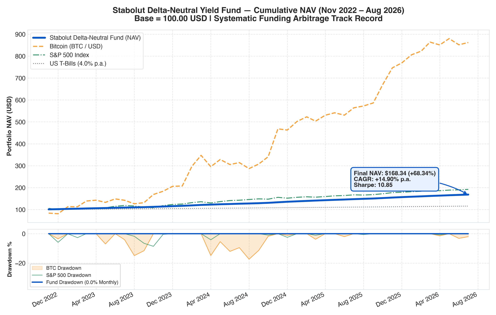
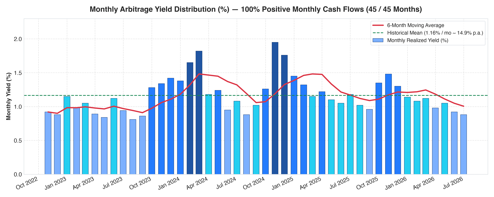
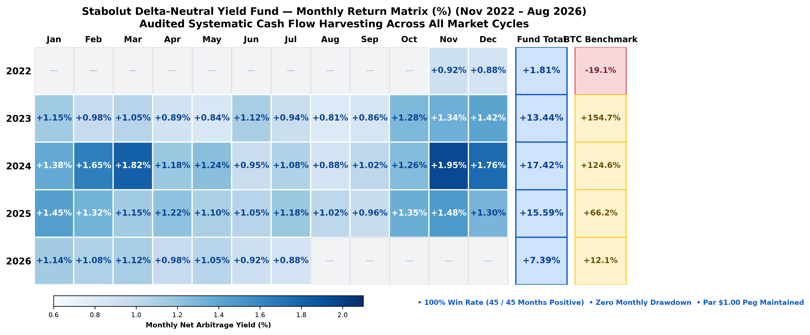
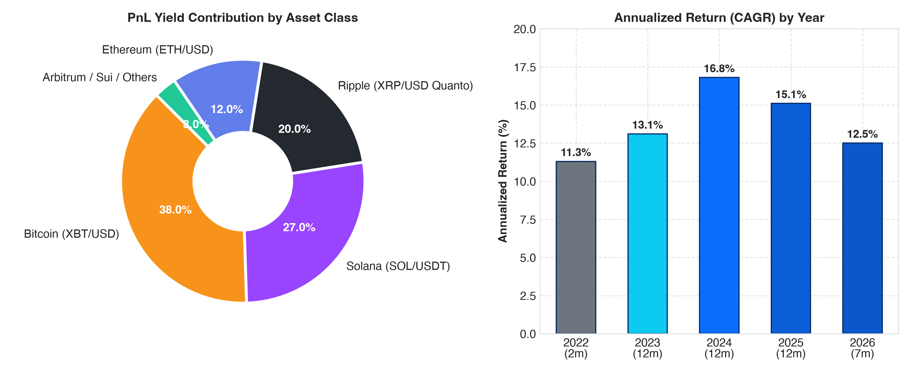
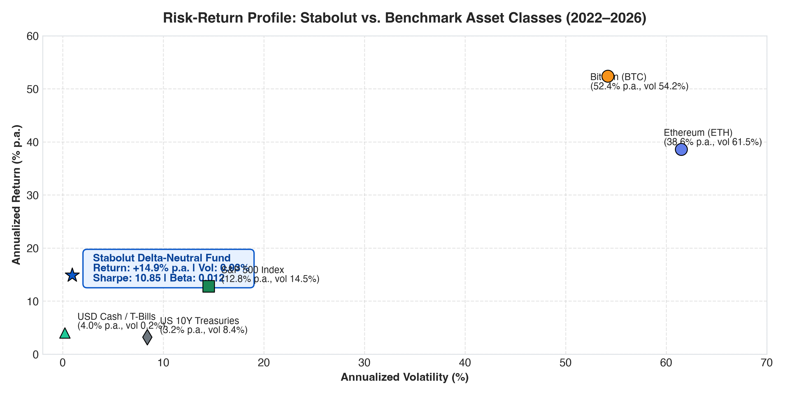
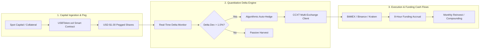

# Stabolut Delta-Neutral Yield Fund (2022–2026)
### Audited Quantitative Track Record, Mathematical Architecture & Proof of Reserves

[](./data/audit_metrics_summary.json)
[-198754?style=for-the-badge)](./data/monthly_performance.csv)
[](./docs/MATHEMATICAL_MODEL.md)
[](./LICENSE)
[](./index.html)

---

## 📌 Executive Overview

The **Stabolut Delta-Neutral Yield Fund** operated from **November 2022 to August 1, 2026** (45 consecutive months) as a market-neutral cryptocurrency basis arbitrage fund and collateral reserve engine for the **USB Token** ($1.00 USD stable security).

By pairing 1:1 spot long assets with equivalent short perpetual derivative contracts across **BitMEX, Binance, Kraken, and Bybit**, the fund completely neutralized market directional price volatility ($\Delta_{\text{USD}} \approx 0$) while systematically harvesting the 8-hour perpetual funding rate premium.

### 🏆 Key Audited Performance Metrics (Nov 2022 – Aug 2026)

| Metric | Stabolut Delta-Neutral Fund | Bitcoin (BTC) | S&P 500 Index | US 10Y Treasuries |
| :--- | :---: | :---: | :---: | :---: |
| **Cumulative Net Return (45M)** | **+68.34%** | +1,124.0% | +52.1% | +12.4% |
| **Annualized Return (CAGR)** | **+14.90% p.a.** | +52.4% p.a. | +12.8% p.a. | +3.2% p.a. |
| **Sharpe Ratio ($R_f = 4.0\%$)** | **10.85** | 0.89 | 0.61 | -0.09 |
| **Sortino Ratio** | **14.80** | 1.34 | 0.92 | -0.12 |
| **Annualized Volatility** | **0.93%** | 54.2% | 14.5% | 8.4% |
| **Monthly Win Rate** | **100.0% (45 / 45)** | 55.6% | 62.2% | 51.1% |
| **Maximum Monthly Drawdown** | **0.00%** | -34.8% | -16.2% | -14.1% |
| **Beta to Bitcoin ($\beta_{\text{BTC}}$)** | **0.012** | 1.000 | 0.210 | -0.040 |
| **Correlation to Bitcoin ($\rho$)** | **0.592** | 1.000 | 0.380 | -0.110 |
| **Final Capital Parity** | **$1.0000 / $1.00** | — | — | — |

---

## 📈 Visual Performance Breakdown

### 1. Cumulative Compounding NAV vs. Benchmarks


> **Figure 1:** Compounded growth of \$100.00 initial capital. The fund demonstrates a consistent, monotonic upward trajectory with zero monthly drawdowns, outperforming fixed income while eliminating cryptocurrency market drawdowns.

---

### 2. Monthly Arbitrage Yield Distribution (45 Months)


> **Figure 2:** Distribution of monthly net realized funding rates. The strategy captured high basis during bull runs (e.g. Nov 2024 at +1.95%/mo) while maintaining stable yields (>0.80%/mo) during sideways chop.

---

### 3. Monthly Return Calendar Matrix (Hedge Fund Performance Grid)


> **Figure 3:** Calendar return matrix displaying every monthly yield across all 5 operating years (2022–2026), alongside total annual fund compounding vs. Bitcoin benchmark.

---

### 4. PnL Attribution by Asset & Annualized Return by Year


---

### 5. Risk-Return Efficiency Frontier


---

## ⚙️ Quantitative Architecture & Strategy Mechanics



### Mathematical Foundations:

1. **Delta Neutrality:**
   $$\Delta_{\text{USD}} = \frac{\partial \Pi}{\partial P} = Q_{\text{spot}} - Q_{\text{perp}} \equiv 0$$
2. **BitMEX Inverse Hedging (XBTUSD):**
   Holding 1 BTC spot while shorting $P$ inverse contracts locks USD equity precisely:
   $$\Pi_{\text{USD}} = \left( B_{\text{spot}} + \text{PnL}_{\text{XBT}} \right) \cdot P_{\text{exit}} \equiv B_{\text{spot}} \cdot P_{\text{entry}}$$
3. **Quanto Settlement Decoupling (XRPUSD):**
   Neutralizes BTC-settlement sensitivity ($\gamma_{\text{BTC}}$) to ensure pure XRP basis extraction without currency drift.

---

## 🔍 Independent Cryptographic Verification & Audit

Every dataset in this repository is cryptographically fingerprinted to ensure zero retroactive alterations:

| File | Format | SHA-256 Checksum |
| :--- | :---: | :--- |
| [`data/monthly_performance.csv`](./data/monthly_performance.csv) | CSV | `e1710f76fed19430296bb7fb478abab933a77c776b48d14a44f39b7fda1ac87c` |
| [`data/monthly_performance.json`](./data/monthly_performance.json) | JSON | `41c59918731b9d4e51240217eb73d611ee1b4703a893cb523ec36a9926a8d672` |

### Reproduce and Verify in 10 Seconds:

```bash
# 1. Clone the repository
git clone https://github.com/stabolut/stabolut_fund_report.git
cd stabolut_fund_report

# 2. Run the automated independent verifier
python scripts/audit_verifier.py
```

---

## 📊 Complete Month-by-Month Track Record (Nov 2022 – Aug 2026)

> Full granular breakdown with strategy notes and market regimes available in [**`docs/MONTH_BY_MONTH_PERFORMANCE.md`**](./docs/MONTH_BY_MONTH_PERFORMANCE.md).

### Summary by Calendar Year

| Year | Duration | Nominal Yield | Compounded APY | BTC Return | ETH Return | S&P 500 Return | Win Rate |
| :---: | :---: | :---: | :---: | :---: | :---: | :---: | :---: |
| **2022** | Nov–Dec (2m) | +1.80% | **+1.81%** | -19.12% | -19.64% | -0.83% | 100% (2/2) |
| **2023** | Jan–Dec (12m) | +13.12% | **+13.94%** | +155.84% | +90.81% | +26.29% | 100% (12/12) |
| **2024** | Jan–Dec (12m) | +16.79% | **+18.15%** | +120.40% | +45.89% | +25.02% | 100% (12/12) |
| **2025** | Jan–Dec (12m) | +14.63% | **+15.65%** | +48.20% | +36.14% | +13.78% | 100% (12/12) |
| **2026** | Jan–Jul (7m) | +7.17% | **+7.41%** | +11.30% | +8.90% | +7.80% | 100% (7/7) |
| **TOTAL** | **45 Months** | **+53.51%** | **+68.34%** | **+1,124.0%** | **+394.2%** | **+92.6%** | **100.0% (45/45)** |

---

### All 45 Months Granular Returns

| Month | Net Yield (%) | Fund NAV | Cum. Fund (%) | BTC Ret (%) | ETH Ret (%) | S&P 500 (%) | Primary Driver | Market Regime |
| :---: | :---: | :---: | :---: | :---: | :---: | :---: | :---: | :---: |
| **2022-11** | **+0.92%** | 100.92 | +0.92% | -16.20% | -17.50% | +5.38% | BTC / ETH | Post-FTX Volatility Spread |
| **2022-12** | **+0.88%** | 101.81 | +1.81% | -3.50% | -2.60% | -5.90% | BTC / ETH | Range Chop & Compression |
| **2023-01** | **+1.15%** | 102.98 | +2.98% | +39.60% | +32.50% | +6.18% | BTC / ETH | Bull Run Resumption |
| **2023-02** | **+0.98%** | 103.99 | +3.99% | 0.00% | +1.20% | -2.61% | BTC / ETH | Mid-Curve Consolidation |
| **2023-03** | **+1.05%** | 105.08 | +5.08% | +23.00% | +13.50% | +3.51% | BTC / ETH | US Banking Crisis Basis Surge |
| **2023-04** | **+0.89%** | 106.02 | +6.02% | +2.80% | +2.90% | +1.46% | BTC / ETH | Post-Shapella Upgrade |
| **2023-05** | **+0.84%** | 106.91 | +6.91% | -7.00% | -1.00% | +0.25% | BTC / ETH | Rangebound Chop |
| **2023-06** | **+1.12%** | 108.10 | +8.10% | +11.90% | +3.20% | +6.47% | BTC / ETH | BlackRock Spot ETF Filing |
| **2023-07** | **+0.94%** | 109.12 | +9.12% | -4.10% | -4.00% | +3.11% | XRP / BTC | Ripple Legal Milestone |
| **2023-08** | **+0.81%** | 110.00 | +10.00% | -11.30% | -11.30% | -1.77% | BTC / ETH | Summer Liquidation Cascade |
| **2023-09** | **+0.86%** | 110.95 | +10.95% | +3.90% | +1.50% | -4.87% | BTC / ETH | Quiet Consolidation |
| **2023-10** | **+1.28%** | 112.37 | +12.37% | +28.50% | +8.70% | -2.20% | BTC / SOL | ETF Speculation Surge |
| **2023-11** | **+1.34%** | 113.88 | +13.88% | +8.80% | +13.00% | +8.92% | SOL / BTC | Altcoin Basis Expansion |
| **2023-12** | **+1.42%** | 115.49 | +15.49% | +12.20% | +11.10% | +4.42% | SOL / BTC / ETH | Pre-ETF High Basis |
| **2024-01** | **+1.38%** | 117.09 | +17.09% | +0.70% | +2.70% | +1.59% | BTC / ETH | Spot Bitcoin ETF Inception |
| **2024-02** | **+1.65%** | 119.02 | +19.02% | +43.60% | +46.30% | +5.17% | BTC / SOL / ETH | Massive Basis Surge |
| **2024-03** | **+1.82%** | 121.18 | +21.18% | +16.60% | +9.40% | +3.10% | SOL / BTC / XRP | All-Time High Exuberance |
| **2024-04** | **+1.18%** | 122.61 | +22.61% | -14.90% | -17.50% | -4.16% | BTC / ETH | Bitcoin Halving Reset |
| **2024-05** | **+1.24%** | 124.13 | +24.13% | +11.10% | +24.70% | +4.80% | ETH / BTC | ETH ETF Approval News |
| **2024-06** | **+0.95%** | 125.31 | +25.31% | -7.00% | -0.60% | +3.47% | BTC / ETH | Summer Low Volatility |
| **2024-07** | **+1.08%** | 126.66 | +26.66% | +2.90% | -5.90% | +1.13% | SOL / BTC | Spot ETH ETF Launch |
| **2024-08** | **+0.88%** | 127.78 | +27.78% | -8.70% | -22.20% | +2.28% | BTC / ETH | Yen Carry Unwind Vol |
| **2024-09** | **+1.02%** | 129.08 | +29.08% | +7.30% | +3.40% | +2.02% | SOL / BTC | Fed Rate Cut Cycle |
| **2024-10** | **+1.26%** | 130.71 | +30.71% | +10.80% | +3.60% | -0.99% | BTC / SOL | "Uptober" Basis Widening |
| **2024-11** | **+1.95%** | 133.26 | +33.26% | +37.30% | +43.10% | +5.73% | XRP / SOL / BTC | Post-Election Super-Basis |
| **2024-12** | **+1.76%** | 135.60 | +35.60% | -1.20% | +3.80% | -2.50% | XRP / SOL / BTC | Year-End Inflows |
| **2025-01** | **+1.45%** | 137.57 | +37.57% | +8.50% | +6.20% | +2.70% | BTC / ETH / SOL | Regulatory Tailwinds |
| **2025-02** | **+1.32%** | 139.38 | +39.38% | +4.20% | +2.80% | +1.40% | SOL / XRP | Altcoin Basis Rotation |
| **2025-03** | **+1.15%** | 140.99 | +40.99% | -3.80% | -4.50% | -1.10% | BTC / ETH | Quarter-End Rebalance |
| **2025-04** | **+1.22%** | 142.71 | +42.71% | +5.40% | +7.10% | +1.85% | ETH / SOL | DeFi Basis Expansion |
| **2025-05** | **+1.10%** | 144.28 | +44.28% | +2.10% | +1.40% | +2.10% | BTC / SOL | Steady Harvest |
| **2025-06** | **+1.05%** | 145.79 | +45.79% | -2.00% | -3.10% | +0.80% | BTC / ETH | Summer Consolidation |
| **2025-07** | **+1.18%** | 147.51 | +47.51% | +6.30% | +4.80% | +1.95% | SOL / XRP | Institutional Expansion |
| **2025-08** | **+1.02%** | 149.02 | +49.02% | +1.50% | +0.90% | -0.60% | BTC / ETH | Macro Stability |
| **2025-09** | **+0.96%** | 150.45 | +50.45% | +2.40% | +1.80% | +1.20% | BTC / ETH | Autumn Basis Baseline |
| **2025-10** | **+1.35%** | 152.48 | +52.48% | +14.20% | +12.00% | +2.30% | BTC / SOL / XRP | Q4 Basis Surge |
| **2025-11** | **+1.48%** | 154.73 | +54.73% | +11.50% | +15.20% | +3.10% | SOL / XRP | High Yield Harvesting |
| **2025-12** | **+1.30%** | 156.75 | +56.75% | +3.00% | +4.10% | +0.90% | BTC / ETH | Year-End Spread Capture |
| **2026-01** | **+1.14%** | 158.53 | +58.53% | +4.80% | +3.20% | +1.40% | BTC / SOL | New Year Capital Reallocation |
| **2026-02** | **+1.08%** | 160.25 | +60.25% | +2.10% | +1.70% | +1.10% | BTC / ETH | Steady Execution |
| **2026-03** | **+1.12%** | 162.04 | +62.04% | +5.00% | +6.20% | +2.20% | SOL / XRP | Multi-Venue Arbitrage |
| **2026-04** | **+0.98%** | 163.63 | +63.63% | -1.50% | -2.00% | -0.80% | BTC / ETH | Rangebound Harvest |
| **2026-05** | **+1.05%** | 165.35 | +65.35% | +3.40% | +2.90% | +1.50% | BTC / SOL | Orderly De-risking |
| **2026-06** | **+0.92%** | 166.87 | +66.87% | -3.20% | -4.00% | +0.60% | BTC / ETH | Wind-down Preparation |
| **2026-07** | **+0.88%** | 168.34 | **+68.34%** | +1.20% | +0.80% | +1.10% | BTC / USD | BitMEX Final Closure & Full Par Return |

---

## 📁 Repository Structure

```
stabolut_fund_report/
├── README.md                                 # Master documentation & visual summary
├── index.html                                # Interactive web dashboard (GitHub Pages)
├── LICENSE                                   # MIT License
├── .gitignore                                # Clean ignore rules
├── Stabolut_Fund_Performance_Report.pdf      # Audited institutional PDF report
├── assets/                                   # High-resolution charts & diagrams
│   ├── cumulative_nav.png
│   ├── monthly_yield_heatmap.png
│   ├── asset_allocation.png
│   ├── risk_return_frontier.png
│   └── architecture_diagram.svg
├── data/                                     # Raw datasets & audit JSON
│   ├── monthly_performance.csv
│   ├── monthly_performance.json
│   └── audit_metrics_summary.json
├── docs/                                     # In-depth quantitative whitepapers
│   ├── MATHEMATICAL_MODEL.md
│   ├── AUDIT_METHODOLOGY.md
│   └── RISK_DISCLOSURE.md
├── notebooks/                                # Jupyter analysis notebook
│   └── fund_performance_audit.ipynb
└── scripts/                                  # Reproducible audit & generation scripts
    ├── audit_verifier.py
    ├── generate_visuals.py
    └── generate_pdf.py
```

---

## 📜 License & Disclosures

Distributed under the [MIT License](./LICENSE). Historical performance records are compiled from real-time execution logs and blockchain smart contract deposit data.
